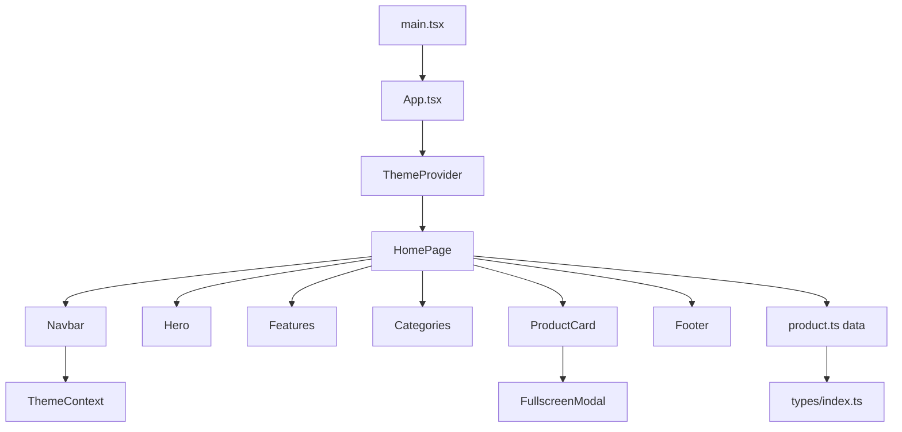

# 📚 SpeakersHub Pro - Project Documentation

## 🏗️ Architecture Overview

SpeakersHub Pro is a modern e-commerce application built with React 19, TypeScript, and Tailwind CSS. The application follows a component-based architecture with clear separation of concerns.

## 🔄 Application Workflow

### 1. Application Bootstrap

```
main.tsx → App.tsx → ThemeProvider → HomePage
```

1. **main.tsx**: Entry point, renders App in StrictMode
2. **App.tsx**: Wraps application with ThemeProvider
3. **ThemeContext**: Provides theme state to entire app
4. **HomePage**: Main application container

### 2. Page Rendering Flow

```
HomePage → Navbar + Hero + Features + Recommended Products + Categories + Product Catalog + Footer
```

## 📁 File Structure & Connections

### Core Application Files

#### `src/main.tsx`

- **Purpose**: Application entry point
- **Dependencies**: `App.tsx`, `index.css`
- **Functionality**: Renders React app in DOM root with StrictMode

#### `src/App.tsx`

- **Purpose**: Root component wrapper
- **Dependencies**: `ThemeProvider`, `HomePage`
- **Functionality**: Provides theme context to entire app

#### `src/index.css`

- **Purpose**: Global styles and Tailwind imports
- **Dependencies**: None
- **Functionality**: Base styles, dark mode variables, custom utilities

#### `projects.ts` (Root Level)

- **Purpose**: Portfolio project data for external reference
- **Dependencies**: `../store/useUIStore` (external reference)
- **Functionality**: Contains project data for portfolio showcase

### Context Layer

#### `src/context/ThemeContext.tsx`

- **Purpose**: Theme management (light/dark mode)
- **Dependencies**: React hooks
- **State**: `theme` (light | dark)
- **Methods**: `toggleTheme()`
- **Features**:
  - System preference detection via `window.matchMedia`
  - localStorage persistence
  - CSS class manipulation on document root

### Data Layer

#### `src/data/product.ts`

- **Purpose**: Static product and category data
- **Dependencies**: `types/index.ts`
- **Exports**:
  - `products`: Array of 17 Product objects
  - `categories`: Array of 5 Category objects
- **Product Categories**:
  - Wireless Speakers (5 products: w1-w5)
  - Soundbars (4 products: s1-s4)
  - Home Theater (5 products: h1-h5)
  - Compact Speakers (4 products: a1-a4)
- **Pricing**: All prices in Romanian Leu (RON)

#### `src/types/index.ts`

- **Purpose**: TypeScript type definitions
- **Exports**:
  - `Product` interface with id, name, price, image, category, brand, rating, description
  - `Category` interface with id, name

### Pages Layer

#### `src/pages/HomePage.tsx`

- **Purpose**: Main landing page
- **Dependencies**: All components, product data
- **State**: `activeCategory` (string)
- **Functionality**:
  - Product filtering by category
  - Renders all page sections in sequence
  - Manages category selection state
  - Displays recommended products (first 4 products)

### Components Layer

#### `src/components/Navbar.tsx`

- **Purpose**: Navigation header
- **Dependencies**: `ThemeContext`, Lucide icons (ShoppingCart, User, Sun, Moon)
- **Features**:
  - Logo with fallback handling for missing image
  - Theme toggle with icon switching
  - Login button (UI only, no functionality)
  - Shopping cart with badge (mock count of 3)
  - Sticky positioning with backdrop blur effect

#### `src/components/Hero.tsx` (HeroVideoAbsoluteControl)

- **Purpose**: Immersive hero section with video background
- **Dependencies**: None
- **Features**:
  - Full-screen video background with autoplay/loop/muted
  - Smooth scroll navigation to categories section
  - Responsive text overlay with "Audio Experience Perfected" messaging
  - Call-to-action button with scroll functionality
  - Video source: `/vid/speaker.mp4` (10.7MB)

#### `src/components/Features.tsx`

- **Purpose**: Feature showcase section
- **Dependencies**: None
- **Features**:
  - Three key features: Premium Quality, Audio Expertise, Fast Delivery
  - Icon-based display with emoji icons
  - Responsive grid layout
  - Hover effects on feature cards

#### `src/components/Categories.tsx`

- **Purpose**: Category filter with visual cards
- **Dependencies**: `types/index.ts`
- **Props**:
  - `categories`: Category array
  - `activeCategory`: string
  - `onCategoryClick`: function
- **Features**:
  - Visual category cards with product images
  - Category descriptions (Portable & Bluetooth, TV Audio Systems, etc.)
  - Active category highlighting with border effects
  - Fallback image handling
  - Section ID: `shop-by-category` for smooth scrolling

#### `src/components/ProductCard.tsx`

- **Purpose**: Individual product display card
- **Dependencies**: `FullscreenModal`, Lucide icons, `types/index.ts`
- **Props**: `product: Product`
- **State**:
  - `isAdded`: boolean (cart animation state)
  - `isFullscreenOpen`: boolean (modal state)
- **Features**:
  - Product image with hover scale effect
  - Star rating display with filled stars
  - Add to cart button with animation (checkmark appears)
  - Fullscreen image viewer trigger
  - Price formatting in Romanian Leu (RON)
  - Glassmorphism design with dark mode support

#### `src/components/FullscreenModal.tsx`

- **Purpose**: Fullscreen image viewer with zoom and navigation
- **Dependencies**: Lucide icons (X, ChevronLeft, ChevronRight)
- **Props**:
  - `isOpen`: boolean
  - `onClose`: function
  - `images`: string array
  - `initialIndex`: number (default 0)
  - `productName`: string
- **State**:
  - `currentIndex`: number (image navigation)
  - `isZoomed`: boolean (zoom state)
- **Features**:
  - Keyboard navigation (Escape, Arrow keys)
  - Image zoom functionality
  - Previous/Next navigation
  - Body scroll lock when open
  - Responsive design

#### `src/components/Footer.tsx`

- **Purpose**: Comprehensive site footer
- **Dependencies**: Lucide icons (Facebook, Twitter, Instagram, Youtube, Mail, Phone, MapPin)
- **Features**:
  - Company information (SpeakersHub, founded 2015)
  - Contact details (email, phone, address)
  - Quick links navigation
  - Product categories links
  - Social media links
  - Dynamic copyright year
  - Multi-column responsive layout

## 🎯 Core Functionalities

### 1. Product Browsing

- **Location**: `HomePage.tsx`, `ProductCard.tsx`
- **Features**:
  - Grid layout display
  - Category filtering
  - Product information display
  - Responsive design

### 2. Category Filtering

- **Location**: `Categories.tsx`, `HomePage.tsx`
- **Flow**:
  1. User clicks category in `Categories.tsx`
  2. `onCategoryClick` updates `activeCategory` in `HomePage`
  3. Products filtered based on selection
  4. UI updates with filtered results

### 3. Theme Management

- **Location**: `ThemeContext.tsx`, `Navbar.tsx`
- **Flow**:
  1. User clicks theme toggle in `Navbar`
  2. `toggleTheme()` called from context
  3. Theme state updated
  4. CSS classes updated on document
  5. Preference saved to localStorage

### 4. Shopping Cart (UI Only)

- **Location**: `ProductCard.tsx`, `Navbar.tsx`
- **Current State**: Mock implementation
- **Features**:
  - Add to cart animation
  - Cart badge display
  - No actual cart management

### 5. Product Image Viewing

- **Location**: `ProductCard.tsx`, `FullscreenModal.tsx`
- **Flow**:
  1. User clicks fullscreen icon on product
  2. Modal opens with product image
  3. User can close modal

## 🔄 Data Flow Diagram

```
product.ts (Static Data - 17 products, 5 categories)
    ↓
HomePage.tsx (State Management - activeCategory filtering)
    ↓
┌─────────────────────────────────────────┐
│  Components                             │
│  ├── Categories.tsx (Filtering)         │
│  ├── ProductCard.tsx (Display)          │
│  ├── Navbar.tsx (Navigation)            │
│  ├── Hero.tsx (Marketing)               │
│  ├── Features.tsx (Features)            │
│  └── Footer.tsx (Footer)                │
└─────────────────────────────────────────┘
    ↓
ThemeContext.tsx (Theme Management - localStorage persistence)
```

## 🎨 UI/UX Features

### Design System

- **Framework**: Tailwind CSS 3.4.18 with custom configuration
- **Theme**: Light/Dark mode support with CSS custom properties
- **Effects**: Glassmorphism, gradients, smooth animations
- **Typography**: Clean hierarchy with responsive font sizes
- **Color Scheme**: Blue/indigo gradients for CTAs, gray scales for content

### Interactive Elements

- **Hover States**: Product cards (scale, shadow), buttons (color transitions)
- **Transitions**: Smooth color and transform animations (300ms duration)
- **Micro-interactions**: Cart add animation (checkmark), theme toggle
- **Responsive**: Mobile-first design with breakpoints (sm, md, lg, xl)
- **Video Background**: Autoplay, muted, loop with overlay gradient

### Accessibility

- **Semantic HTML**: Proper heading hierarchy (h1-h4)
- **ARIA Labels**: Screen reader support for interactive elements
- **Keyboard Navigation**: Tab-friendly interface, modal keyboard controls
- **Color Contrast**: WCAG compliant colors with dark mode variants
- **Focus States**: Visible focus indicators for keyboard users

## 🔧 Technical Implementation

### State Management

- **Theme**: React Context API with localStorage persistence
- **Category Selection**: Local component state (useState)
- **Cart Interactions**: Local component state with timeout animations
- **Modal State**: Local component state with body scroll lock

### Styling Strategy

- **Utility-first**: Tailwind CSS classes for rapid development
- **Component-specific**: Inline styles for dynamic positioning (Hero component)
- **Dark Mode**: CSS classes with Tailwind dark variant
- **Responsive Design**: Mobile-first with progressive enhancement

### Performance Considerations

- **Image Optimization**: AVIF format for modern browsers, JPG fallbacks
- **Video Optimization**: Muted autoplay, compressed MP4 (10.7MB)
- **Component Optimization**: Local state management, minimal re-renders
- **Bundle Size**: Tree-shaking with Vite, optimized dependencies

## 🚀 Build & Deployment

### Development

- **Server**: Vite dev server
- **Hot Reload**: Fast refresh enabled
- **Type Checking**: TypeScript compilation

### Production

- **Build**: Vite optimization
- **Deployment**: Netlify configuration
- **Static Assets**: Optimized and minified

## 🔮 Future Architecture Considerations

### State Management Enhancement

- **Global State**: Zustand for cart, user, products
- **Server State**: React Query for API data
- **Form State**: React Hook Form for checkout

### API Integration

- **Backend**: REST/GraphQL API
- **Authentication**: JWT tokens
- **Payment**: Stripe integration

### Performance Optimizations

- **Code Splitting**: Lazy loading for routes
- **Image Optimization**: WebP format, responsive images
- **Caching**: Service worker implementation

## 📊 Component Dependencies



## 🛠️ Development Guidelines

### Code Organization

- **Components**: Feature-based grouping
- **Types**: Centralized type definitions
- **Data**: Separated static data
- **Context**: Isolated state management

### Best Practices

- **TypeScript**: Strict typing throughout
- **React**: Functional components with hooks
- **CSS**: Utility-first approach
- **Accessibility**: WCAG 2.1 compliance

---

This documentation provides a comprehensive overview of the SpeakersHub Pro project structure, workflows, and technical implementation.
